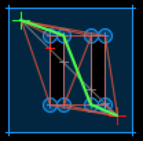

# Quickstart

## Search a 2D Polygon Map

There's four steps to do a 2D polygon map path search

1. Create a polygon map with holes
1. Create a graph from the map
1. Extend the graph with your start and stop
1. Use Astar to find a path

You can try out the code below in iex.

```shell
iex -S mix
```

```elixir
alias Scurry.PolygonMap
alias Scurry.Vector
alias Scurry.Astar

## Step 1 - define the world

# The world is defined by a boundary box plus holes inside the box.

# World boundary
polygon = [{0, 0}, {100, 0}, {100, 100}, {0, 100}]

# Two holes
holes = [
 [{30, 30}, {40, 30}, {40, 70}, {30, 70}],
 [{60, 30}, {70, 30}, {70, 70}, {60, 70}],
]

## Step 2 - convert world to graph

# To compute a path, we need to convert the boundary & holes into
# a graph of all corners.

# The cost function for the graph, this uses basic euclidian distance
# as a basic example. This is used to compute the graph of the world.
cost_fun = fn a, b -> Vector.distance(a, b) end

# Find the reachable vertices
vertices = PolygonMap.get_vertices(polygon, holes)

# Make a graph of them using an optional cost_fun
graph = PolygonMap.create_graph(polygon, holes, vertices, cost_fun)

## Step 3 - extend graph with actor start/stop

# For an actor to move from a to b in the world, we first extend the
# graph with start and stop

# Define our start & stop
{start, stop} = {{10, 10}, {90, 90}}

# Create the temporary extended graph with start & stop and an optional cost_fun
{search_graph, _} =
  PolygonMap.extend_graph(graph, polygon, holes,
  vertices, [start, stop], cost_fun)

## Step 4

# Given the new graph, finally compute the path in the world.

# The heuristic function for A-star, this uses euclidian distance as well.
# This is used as the cost of each edge traversal in the graph during a-star
# path finding. It can be the same as cost_fun but it does not have to be.
heur_fun = fn a, b -> Vector.distance(a, b) end

# Astar search
astar = Astar.search(search_graph, start, stop, heur_fun)
path = Astar.path(astar)

# Result
[{10, 10}, {40, 30}, {60, 70}, {90, 90}]
```



## Search a adhoc graph

Very similar to an 2D polygon map. A graph doens't have to be screen
coordinates, just terms that can be map keys.

1. Create a graph
1. Use Astar to find a path

```elixier
alias Scurry.Astar

## Step 1

# A graph is a map from nodes to a list of edges, an edge is a {node,
# cost} tuple.

graph = fn ->
  %{
    "a" => [{"b", 4}, {"c", 3}],
    "b" => [{"f", 5}, {"e", 12}],
    "c" => [{"e", 10}, {"d", 7}],
    "d" => [{"e", 2}],
    "e" => [{"z", 5}],
    "f" => [{"z", 16}],
  }
end

# The heuristic function takes two nodes and returns an estimated
# cost. It will be called with the destination node passed to A-star.

heur = fn from, to ->
  %{
    "a" => %{"z" => 14},
    "b" => %{"z" => 12},
    "c" => %{"z" => 11},
    "d" => %{"z" => 6},
    "e" => %{"z" => 4},
    "f" => %{"z" => 11},
    "z" => %{"z" => 0},
  }[from][to]
end

## Step 2

# Astar search

state = Astar.search(graph.(), "a", "z", heur)
path = Astar.path(state)

# Result
["a", "c", "d", "e", "z"]
```
