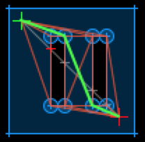

## Quickstart

* Create a polygon map with holes
* Create a graph from that
* Use Astar to find a path

```elixir
# World boundary
polygon = [{0, 0}, {100, 0}, {100, 100}, {0, 100}]

# Two holes
holes = [
 [{30, 30}, {40, 30}, {40, 70}, {30, 70}],
 [{60, 30}, {70, 30}, {70, 70}, {60, 70}],
]

# The cost function for the graph, euclidian distance
cost_fun = fn a, b -> Vector.distance(a, b) end

# The heuristic function for A-star, euclidian distance as well
heur_fun = fn a, b -> Vector.distance(a, b) end

# Find the reachable vertices
vertices = PolygonMap.get_vertices(polygon, holes)

# Make a graph of them using cost_fun (optional)
graph = PolygonMap.create_graph(polygon, holes, vertices, cost_fun)

# Define our start & stop
{start, stop} = {{10, 10}, {90, 90}}

# Create the temporary extended graph with start & stop & (optional) cost_fun
{search_graph, _} =
  PolygonMap.extend_graph(graph, polygon, holes,
  vertices, [start, stop], cost_fun)

# Astar search
astar = Astar.search(search_graph, start, stop, heur_fun)
path = Astar.path(astar)

[{10, 10}, {40, 30}, {60, 70}, {90, 90}]
```


